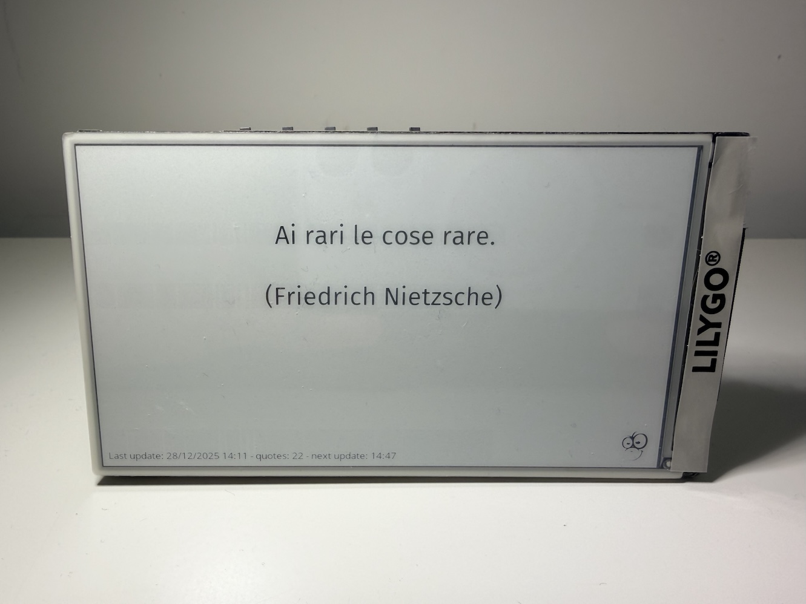

# Lilygo T5-4.7 Quote Display

> An ESP32-based e-paper display that fetches and displays random Italian quotes with WiFi provisioning, deep sleep power management, and smart wake controls.



## 📖 Overview

This project transforms the Lilygo T5-4.7 e-paper display into an elegant quote display that:
- Fetches random Italian quotes from a REST API
- Displays quotes with automatic word wrapping and beautiful typography
- Manages WiFi credentials through a captive portal interface
- Uses deep sleep to maximize battery life
- Wakes periodically (10-60 minutes, randomized) to refresh quotes
- Supports manual refresh and network reset via physical buttons

## ✨ Features

### Core Functionality
- **Italian Quote Display**: Fetches random quotes from [quotes-api-three.vercel.app](https://quotes-api-three.vercel.app)
- **Automatic Word Wrapping**: Smart text layout with centered alignment
- **Quote Counter**: Tracks total number of quotes displayed
- **Next Update Display**: Shows when the next quote will appear
- **Battery Monitoring**: Real-time battery percentage display on status line
- **Time Synchronization**: SNTP integration for Europe/Rome timezone

### WiFi Management
- **Captive Portal Provisioning**: Easy WiFi setup via web interface
- **Unique AP SSID**: Each device creates `WMQuote_XX` network (last byte of MAC)
- **Credential Storage**: Persistent WiFi settings in NVS
- **Network Reset**: Factory reset via GPIO 35 (3 presses in 10 seconds)

### Power Efficiency
- **Deep Sleep Mode**: Ultra-low power consumption between updates
- **Random Wake Intervals**: 10-60 minute intervals to vary quote updates
- **Smart Display Updates**: E-paper only refreshes when needed

### User Interface
- **Loading Animations**: Random gerund words displayed during startup
- **Button Controls**:
  - **GPIO 39**: Manual quote refresh
  - **GPIO 35**: Network configuration reset
- **Visual Feedback**: Clear on-screen instructions for all modes

## 🔧 Hardware Requirements

- **Board**: [Lilygo T5-4.7](https://www.lilygo.cc/products/t5-4-7-inch-e-paper-v2-3)
- **Display**: 4.7" E-Paper (ED047TC1), 960x540 resolution, 16 grayscale levels
- **MCU**: ESP32 with PSRAM
- **Memory**: 16MB Flash minimum
- **Buttons**:
  - GPIO 39: Quote refresh button
  - GPIO 35: Network reset button

## 💻 Software Requirements

- **ESP-IDF**: v5.4.1 or later
- **EPDiy Library**: Included via ESP component manager
- **Python**: 3.8+ (for ESP-IDF tools)

## 🚀 Getting Started

### Installation

1. **Clone the repository**:
   ```bash
   git clone https://github.com/arizzi74/lilygo-quote-display.git
   cd lilygo-quote-display
   ```

2. **Set up ESP-IDF** (if not already installed):
   ```bash
   # Follow ESP-IDF installation guide
   # https://docs.espressif.com/projects/esp-idf/en/latest/esp32/get-started/
   ```

3. **Build the project**:
   ```bash
   idf.py build
   ```

4. **Flash to device**:
   ```bash
   idf.py -p /dev/ttyUSB0 flash
   ```

5. **Monitor output** (optional):
   ```bash
   idf.py monitor
   ```

### First-Time Setup

1. **Power on the device** - it will enter provisioning mode
2. **Connect to WiFi**: Look for `WMQuote_XX` network (where XX is device-specific)
3. **Open browser**: Navigate to `http://192.168.4.1`
4. **Enter credentials**: Input your WiFi SSID and password
5. **Save**: Device will restart and connect to your network
6. **Enjoy**: Your first quote will appear automatically!

## 📱 Usage

### Normal Operation

Once configured, the device:
1. Wakes from deep sleep (random 10-60 minute intervals)
2. Displays a random loading gerund ("Thinking...", "Pondering...", etc.)
3. Connects to WiFi
4. Syncs time via SNTP
5. Reads battery voltage and calculates percentage
6. Fetches a random Italian quote
7. Displays the quote with author, timestamp, next update time, and battery percentage
8. Returns to deep sleep

### Manual Quote Refresh

Press **GPIO 39 button** at any time to:
- Wake the device from sleep
- Immediately fetch and display a new quote
- Reset the sleep timer

### Network Reset

To reset WiFi configuration:

1. Press **GPIO 35 button** to wake
2. Device displays: "To reset network configuration press same button 3 times in next 10 seconds or wait to cancel"
3. Press **GPIO 35** three more times within 10 seconds
4. WiFi credentials are erased
5. Device reboots into provisioning mode

## ⚙️ Configuration

### Display Layout

The display shows:
- **Center**: Quote text (word-wrapped, large font)
- **Below quote**: Author name in parentheses
- **Bottom-left**: Status line with:
  - Last update timestamp
  - Total quote count
  - Next update time (HH:MM)
  - Battery percentage
- **Bottom-right**: 64x64 pixel logo

### WiFi Settings

- **AP SSID Format**: `WMQuote_XX` (XX = last MAC byte in hex)
- **AP Password**: Open network (no password)
- **AP IP**: 192.168.4.1
- **Configuration URL**: http://192.168.4.1

### Sleep Configuration

- **Minimum Sleep**: 10 minutes
- **Maximum Sleep**: 60 minutes
- **Mode**: Randomized for variety

### API Configuration

- **Quote API**: https://quotes-api-three.vercel.app/random
- **SNTP Server**: pool.ntp.org
- **Timezone**: UTC+1 (Europe/Rome)

## 📂 Project Structure

```
lilygo-quote-display/
├── main/
│   ├── main.c              # Application entry point
│   ├── display_ui.c/h      # E-paper display rendering
│   ├── wifi_manager.c/h    # WiFi provisioning & management
│   ├── webserver.c/h       # HTTP server for provisioning
│   ├── wikiquote.c/h       # Quote API integration
│   ├── sleep_manager.c/h   # Deep sleep management
│   ├── battery.c/h         # Battery voltage monitoring
│   ├── gerunds.c/h         # Loading screen word list
│   ├── config_page.h       # Embedded HTML for provisioning
│   ├── firasans_20.h       # Large font
│   ├── firasans_12.h       # Medium font
│   ├── opensans8.h         # Small font
│   ├── wm_logo_256.h       # 256x256 logo (provisioning)
│   └── wm_logo_64.h        # 64x64 logo (quote display)
├── CMakeLists.txt          # Build configuration
├── dependencies.lock       # Component version lock
├── sdkconfig.defaults      # Default ESP-IDF configuration
├── partitions.csv          # Flash partition table
├── gerunds.txt             # Source list of loading words
├── DOCUMENTATION.md        # Detailed technical documentation
└── README.md               # This file
```

## 🔍 Technical Details

### Memory Usage
- **Flash**: ~1.46 MB / 3 MB (48%)
- **SRAM**: ~45 KB / 520 KB (data + bss)
- **PSRAM**: ~500 KB (framebuffer)

### Display Specifications
- **Resolution**: 960x540 pixels (landscape)
- **Color Depth**: 4-bit grayscale (16 levels)
- **Update Mode**: MODE_GC16 (16 grayscale levels)
- **Temperature**: 25°C (configurable)

### Power Consumption
- **Active**: ~200-300mA (WiFi + display update)
- **Deep Sleep**: ~10-15µA
- **Battery Reading**: ~51ms per wake cycle (negligible impact)
- **Wake Sources**: Timer, GPIO 39 (EXT0), GPIO 35 (EXT1)

### Battery Monitoring
- **GPIO**: 36 (ADC1_CHANNEL_0)
- **Voltage Divider**: 2:1 ratio (2x 100kΩ resistors, built into hardware)
- **ADC Resolution**: 12-bit (0-4095)
- **Voltage Range**: ≥4.0V = 100%, linear 4.0V→3.0V = 100%→0%
- **Sampling**: 64 samples averaged with 2ms inter-sample delays
- **Stabilization**: 100ms delay after EPD power-on for voltage settling
- **Calibration**: eFuse vref for accurate readings
- **Timing**: Read after WiFi connects but before transmissions (minimal interference)
- **NVS Logging**: Each reading saved to NVS with timestamp, raw ADC, voltage, percentage
- **Display**: Shows percentage on status line or "--%" on error
- **Debug**: Last reading printed on startup for battery-powered debugging

### Persistent Storage (NVS)
- **Namespace "wifi_config"**:
  - `ssid`: WiFi network name (max 32 chars)
  - `password`: WiFi password (max 64 chars)
  - `quote_count`: Total quotes displayed (uint32_t)
- **Namespace "battery_log"**:
  - `last_reading`: Battery reading struct (timestamp, ADC raw, voltage mV, actual voltage, percentage)

## 📚 Documentation

For detailed technical documentation including:
- Complete system architecture
- Flow diagrams for all operations
- Module documentation
- API reference
- Configuration details

See [DOCUMENTATION.md](DOCUMENTATION.md)

## 🛠️ Development

### Building

```bash
# Clean build
idf.py fullclean
idf.py build

# Flash and monitor
idf.py -p /dev/ttyUSB0 flash monitor
```

### Debugging

Enable debug logs by modifying `sdkconfig.defaults`:
```
CONFIG_LOG_DEFAULT_LEVEL_DEBUG=y
```

### Adding Custom Gerunds

Edit `gerunds.txt` and rebuild. The word list is compiled into `main/gerunds.h`.

## 🐛 Troubleshooting

### Display Shows Garbage
- **Cause**: Framebuffer not cleared
- **Solution**: Verify `epd_clear()` called before drawing

### WiFi Won't Connect
- **Cause**: Incorrect credentials
- **Solution**: Use GPIO 35 reset to clear credentials and reconfigure

### Quote Not Fetching
- **Cause**: SNTP time not synced
- **Solution**: Check logs for SNTP timeout, verify network connectivity

### Button Wake Not Working
- **Cause**: GPIO pull-up not configured
- **Solution**: Verify `sleep_manager_init()` called during startup

## 📄 License

This project uses:
- **ESP-IDF**: Apache 2.0 License
- **EPDiy**: MIT License

## 🙏 Credits

- **EPDiy Library**: [vroland/epdiy](https://github.com/vroland/epdiy)
- **Italian Quotes API**: [gpalleschi/quotes_api](https://github.com/gpalleschi/quotes_api) by Giovanni Palleschi
- **Hardware**: [Lilygo](https://www.lilygo.cc/)

---

**🤖 Generated with [Claude Code](https://claude.com/claude-code)**

**Version**: 1.1
**Last Updated**: February 2026
**Author**: Antonio
